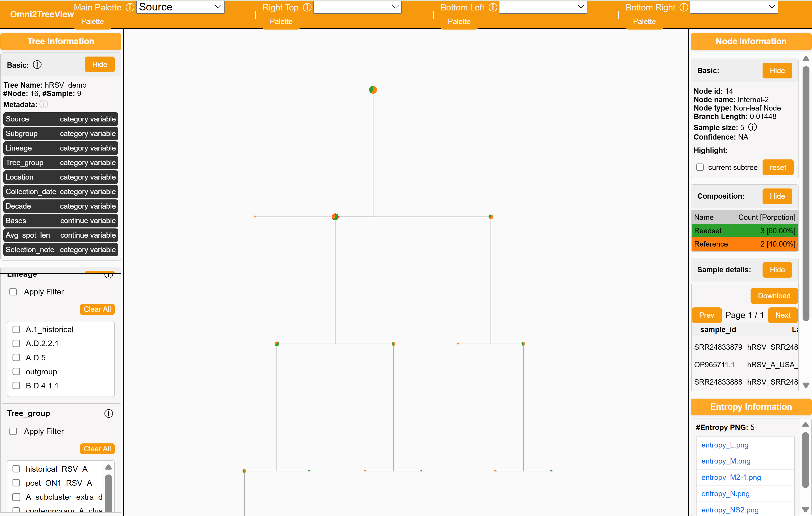

# Omni2Tree demo dataset

This demo keeps the input small while preserving enough tree structure for a useful visualization.

## Selection

- 4 readsets: `SRR24833886`, `SRR24833879`, `SRR24833888`, `SRR24833895`.
- 5 reference assemblies: `A2`, `HRSV/A/England/397/2017`, `hRSV/A/USA/202195752/2021`, `hRSV/B/Australia/VIC-RCH056/2019`, `hMPV_CAN97-83`.
- `hMPV_CAN97-83` is the outgroup.

The readsets total about 53M on disk. The selected reference AA FASTA files are all about 3-6 KB each, and the selected CDS FASTA files are about 14-16 KB each.

## Metadata columns

`data/metadata.csv` keeps columns that should be useful for visualization:

- `subgroup`: RSV-A, RSV-B, hMPV, or inferred readset subgroup.
- `lineage`: Goya 2024 lineage where available.
- `tree_group`: compact display group based on the full run.
- `location`, `collection_date`, `decade`.
- `bases`, `avg_spot_len`.
- `selection_note`: why the item is in the demo.

## Suggested run

Run from `data/`. The commands below write new outputs to `../my_results` so the bundled `../results` folder remains available for comparison.

Download the selected SRA readsets:

```bash
o2t-sra -i reads.csv -o reads --layout SINGLE |& tee hRSV_sra.log
```

Create the reference database from 5 assemblies:

```bash
o2t-step1 -i accessions.csv -g outgroup.csv -T 3 --o2t_out ../my_results |& tee hRSV_step1.log
```

Generate one consensus sequence per readset:

```bash
parallel -j 4 o2t-step2 -r {1} --o2t_out ../my_results -T 2 ::: \
  $(ls reads/hRSV_*fastq | sort) |& tee -a hRSV_step2.log
```

Build the final tree, entropy tables, plots, and HTML visualization:

```bash
o2t-step3 -o ../my_results -m metadata.csv -l hRSV_demo --seq_type aa -T 3 -r \
  --exclude_pattern "s0" --min_samples 4 |& tee hRSV_step3.log
```

The `--exclude_pattern "s0"` parameter excludes the reference sequences from the entropy analysis.

## How to confirm success

Compare your generated `../my_results` folder with the bundled [results](results) folder. The three most useful files to review are `results/O2T_RESULTS/concat_merge_view_aa.phy.treefile`, `results/stats/entropy/aa_entropy.csv`, and `results/visualization/omni2treeview_hRSV_demo.html`; as an extra, inspect the remaining output files to understand how Omni2Tree organizes the full run.

### Example HTML Visualization



## Running with Docker

The demo data is bundled in the image. Mount a local directory for results and run all steps in one container:

```bash
docker run --rm -it \
  -v "$PWD/my_results:/opt/omni2tree/demo/my_results" \
  omni2tree \
  bash -c 'cd /opt/omni2tree/demo/data &&
    o2t-sra -i reads.csv -o reads --layout SINGLE &&
    o2t-step1 -i accessions.csv -g outgroup.csv -T 3 --o2t_out ../my_results &&
    parallel -j 4 o2t-step2 -r {1} --o2t_out ../my_results -T 2 ::: $(ls reads/hRSV_*fastq | sort) &&
    o2t-step3 -o ../my_results -m metadata.csv -l hRSV_demo --seq_type aa -T 3 -r --exclude_pattern "s0" --min_samples 4'
```

Outputs land in `my_results/` on your host. SRA reads are downloaded inside the container during the run and do not persist after exit.
